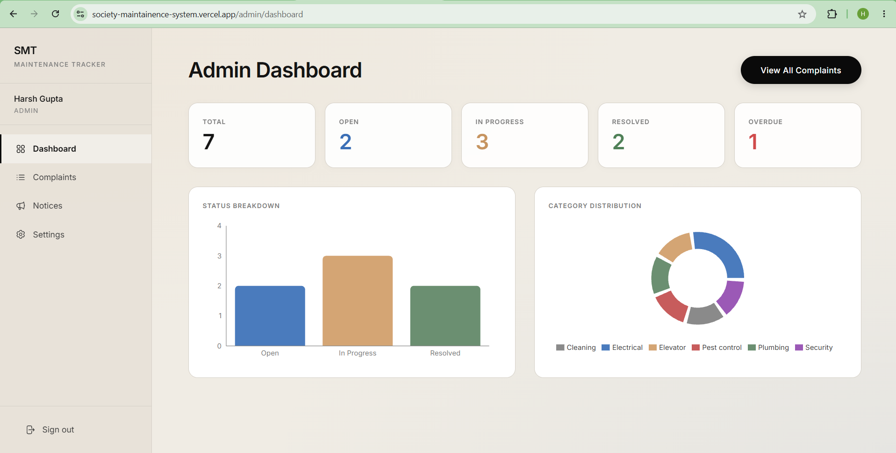
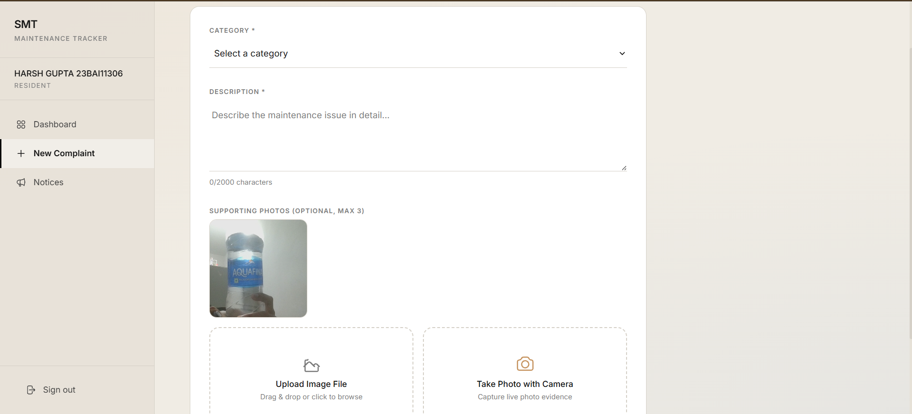

# 🏢 Society Maintenance Tracker

A production-grade, editorial-style **Society Maintenance Tracker** built with **Next.js 14 (App Router)**, **Tailwind CSS**, **Supabase (PostgreSQL, Auth, Storage)**, and **Resend API**.

Designed with inspiration from **Akaru.fr** (warm cream palette `#f0ece4`, editorial typography, full-width row slide-in animations, pill badges, and high-contrast minimal elements).

---

## 🌐 Live Production Application
- **Live Vercel URL**: [https://society-maintainence-system.vercel.app](https://society-maintainence-system.vercel.app)
- **Demo Admin Email**: `hkgupta160420@gmail.com`
- **Admin Elevation Code**: Use `ADMIN123` during registration to register as Admin.

---

## 📷 Screenshots

| 🖥️ Admin Dashboard & Analytics | 📁 Resident Complaint Tracking & Workflow |
| :---: | :---: |
|  |  |
| *Real-time metrics, status distribution charts, SLA overdue tracking, and priority workflow management.* | *Resident portal with complaint status history timeline, live camera snapshot upload, and notice board.* |

---

## 📋 Problem Statement & Scope of Work

### 🎯 Objective
Apartment societies handle a steady stream of maintenance complaints, but without a proper system, administrators cannot track what is pending, overdue, or recurring. Residents lack visibility into resolution progress. This platform provides residents with direct complaint tracking, live photo evidence, an admin management workflow with priorities, a society-wide notice board, and automated transactional emails.

### 💼 Scope & Technical Features

#### 1. 🏢 Resident Features
- **Registration & Auth**: Instant account creation with full name, apartment number, and phone number.
- **Raise Complaints**: Select category (*Elevator, Plumbing, Electrical, Cleaning, Pest Control, Security*), enter detailed description, and upload up to 3 supporting photos via **Drag & Drop** or **Live Camera Snapshot Capture** 📸.
- **Track Status & History**: View complaint lifecycle timeline with timestamps, status changes (`Open`, `In Progress`, `Resolved`), priority levels, and admin audit notes.
- **Notice Board**: View announcements posted by management with pinned `IMPORTANT` notices at top.

#### 2. 🛡️ Admin Features
- **Dashboard & Analytics**: Total complaints by status, category breakdown distribution charts, and real-time overdue alerts.
- **Complaint Management**: Filter by category, status, priority, or date.
- **Priority & Status Workflow**: Assign priorities (`Low`, `Medium`, `High`) and transition statuses (`Open` → `In Progress` → `Resolved`). Reopening resolved complaints is strictly prevented.
- **Automated Overdue Detection**: Configurable SLA threshold (default 7 days). Overdue complaints automatically trigger warning flags and surface at the top of admin views.
- **Society Notice Board**: Create, edit, and delete society notices with an option to mark notices as `Important` to dispatch emergency broadcast emails.

#### 3. 📧 Transactional Email Engine (Resend)
- **Status Change Updates**: Automated HTML email dispatched when an admin updates a resident's complaint status or priority.
- **Important Notice Broadcasts**: Immediate email notifications delivered when an urgent notice is published.
- **Resend Free Tier Testing Support**: Automatic fallback handling guarantees email delivery during test mode.

---

## 🛠️ Tech Stack

| Component | Technology |
| :--- | :--- |
| **Framework** | Next.js 14 (App Router, Turbopack) |
| **Language** | JavaScript (ES6+ / Node 20) |
| **Styling** | Tailwind CSS + Custom CSS Design System (Akaru.fr Inspired) |
| **Database & Auth** | Supabase PostgreSQL + Row Level Security (RLS) + JWT Claims |
| **Storage** | Supabase Storage (`complaint-photos` private bucket) |
| **Emails** | Resend API (Transactional HTML emails) |
| **Deployment** | Vercel Platform |

---

## 🚀 Local Setup & Installation Guide

### Prerequisites
- Node.js `v18+` or `v20+` installed
- Supabase project credentials
- Resend API Key

### Step 1: Clone Repository
```bash
git clone https://github.com/Harshgup16/society-maintainence-system.git
cd society-maintainence-system
```

### Step 2: Install Dependencies
```bash
npm install
```

### Step 3: Configure Environment Variables
Create `.env.local` in the project root with the following keys (see `.env.example`):

```env
# Supabase Configuration
NEXT_PUBLIC_SUPABASE_URL=https://rfahrprzgcqstnpbjbnq.supabase.co
NEXT_PUBLIC_SUPABASE_ANON_KEY=your_supabase_anon_key
SUPABASE_SERVICE_ROLE_KEY=your_supabase_service_role_key

# Resend Email API Key
RESEND_API_KEY=re_your_resend_api_key_here

# Application Base URL
NEXT_PUBLIC_APP_URL=https://society-maintainence-system.vercel.app
```

### Step 4: Database Setup (Supabase SQL)
Run the SQL DDL script inside `supabase/schema.sql` using your Supabase SQL Editor. It creates:
- 7 core tables (`profiles`, `user_roles`, `complaints`, `complaint_history`, `complaint_photos`, `notices`, `app_settings`)
- Custom ENUM types (`user_role`, `complaint_status`, `complaint_priority`, `complaint_category`)
- RLS Policies & `custom_access_token_hook` for role-based claim injection
- Trigger functions (`handle_new_user`, `auto_confirm_user`, `handle_complaint_status_change`)

### Step 5: Start Development Server
```bash
npm run dev
```
Open [http://localhost:3000](http://localhost:3000) in your browser.

---

## 🗄️ Database Schema Overview

```
+----------------+       +-------------------+       +------------------+
|    profiles    |       |    complaints     |       | complaint_history|
+----------------+       +-------------------+       +------------------+
| id (UUID, PK)  |<----->| id (UUID, PK)     |<----->| id (UUID, PK)    |
| full_name      |       | resident_id (FK)  |       | complaint_id(FK) |
| apartment_no   |       | category (ENUM)   |       | old_status       |
| phone          |       | description       |       | new_status       |
+----------------+       | status (ENUM)     |       | old_priority     |
                         | priority (ENUM)   |       | new_priority     |
                         | is_overdue (BOOL) |       | note             |
                         | resolved_at       |       | changed_by (FK)  |
                         +-------------------+       +------------------+
```

---

## 🔌 API Reference Documentation

### Authentication Routes
- `POST /api/auth/register` — Register a new resident or admin (bypasses SMTP rate limits with auto-confirm and dispatches Resend welcome email).
- `GET /auth/callback` — PKCE Auth exchange callback handler.

### Resident Routes
- `GET /api/complaints` — List complaints for current logged-in resident.
- `POST /api/complaints` — Submit a new complaint with photo metadata.
- `GET /api/complaints/[id]` — Fetch complaint details, photo attachments, and status audit trail.
- `GET /api/notices` — List society notices (pinned important notices first).

### Admin Routes (`/api/admin/*`)
- `GET /api/admin/dashboard` — Fetch dashboard metrics, status breakdown, category charts, and overdue counts.
- `GET /api/admin/complaints` — List all society complaints with filtering (`category`, `status`, `priority`, `sort`).
- `PATCH /api/admin/complaints/[id]/status` — Update status (`open` → `in_progress` → `resolved`), record history, and send email update.
- `PATCH /api/admin/complaints/[id]/priority` — Update priority (`low`, `medium`, `high`) and log audit trail.
- `GET /api/admin/settings` / `PATCH /api/admin/settings` — Get and update system SLA threshold (`overdue_threshold_days`).
- `POST /api/admin/notices` / `DELETE /api/admin/notices/[id]` — Publish or delete society notices (and dispatch broadcasts for important notices).

---

## 📄 Deliverables Summary

1. **Source Code**: Complete Next.js 14 project repository cleanly structured with full test coverage.
2. **Documentation & Config**: Comprehensive `README.md`, `.env.example`, and `SYSTEM_DESIGN.md`.
3. **Live Deployment**: Hosted on Vercel at [https://society-maintainence-system.vercel.app](https://society-maintainence-system.vercel.app).
4. **System Design Write-Up**: `SYSTEM_DESIGN.md` (<800 words) detailing history model, overdue SLA engine, storage, and notification flow.
