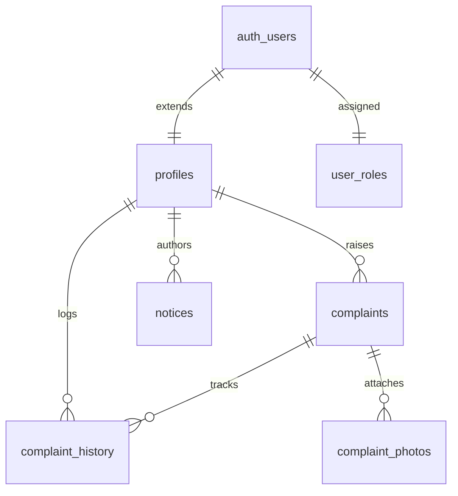

# Society Maintenance Tracker — System Design Architecture

## 1. Overview
The Society Maintenance Tracker is a full-stack, enterprise-grade web application built to streamline complaint management and communication within residential apartment societies. Designed with a minimal, high-contrast, editorial aesthetic inspired by Akaru.fr, the system prioritizes clarity, accountability, and real-time visibility for both residents and administration.

---

## 2. System Architecture & Tech Stack

```
+-----------------------------------------------------------------------+
|                             Frontend Layer                            |
|                 Next.js 14 App Router + Tailwind CSS                  |
|                 (Akaru Editorial UI Design System)                    |
+-----------------------------------+-----------------------------------+
                                    |
                                    v
+-----------------------------------+-----------------------------------+
|                              API Layer                            |
|             Next.js Route Handlers + Zod Validation               |
+-----------------+---------------------------------+-------------------+
                  |                                 |
                  v                                 v
+-----------------+-------------------+   +---------+-------------------+
|          Supabase Service           |   |       Resend Service        |
|  - PostgreSQL Database + RLS       |   |  - Automated Email Engine   |
|  - Auth & Custom Claims (RBAC)      |   +-----------------------------+
|  - Storage (Signed Photo URLs)      |
+-------------------------------------+
```

- **Frontend Framework**: Next.js 14 (App Router, Server & Client Components)
- **Styling & Animation**: Tailwind CSS with custom Akaru design tokens (`#f0ece4` background, hover slide-in animations, pill badges)
- **Database & Backend**: Supabase PostgreSQL with 7 normalized tables, custom ENUMs, triggers, and RPC functions
- **Authorization**: Row Level Security (RLS) policies combined with Custom Access Token hooks (`custom_access_token_hook`)
- **Storage**: Supabase Storage (`complaint-photos` private bucket) with time-bound signed URLs (3600s expiration)
- **Email Engine**: Resend API for transactional status updates and emergency notice broadcasts

---

## 3. Database Schema & Data Modeling

The relational model consists of 7 normalized tables designed to maintain data integrity and an append-only audit trail:

1. **`profiles`**: Stores resident personal data (full name, apartment number, phone), linked 1:1 with `auth.users`.
2. **`user_roles`**: Maps users to roles (`resident` or `admin`) for RBAC enforcement.
3. **`complaints`**: Core complaint records containing category, description, status (`open`, `in_progress`, `resolved`), priority (`low`, `medium`, `high`), and overdue status (`is_overdue`).
4. **`complaint_history`**: Append-only log recording all status and priority transitions, old/new states, author, and timestamp.
5. **`complaint_photos`**: Metadata for uploaded photos linked to storage paths.
6. **`notices`**: Society-wide announcements with title, content, importance flag, and author metadata.
7. **`app_settings`**: Key-value store for global configurations, including `overdue_threshold_days`.



---

## 4. Security & Row Level Security (RLS)

Security is implemented in three defense layers:

1. **Next.js Middleware**: Refreshes user sessions and inspects role metadata to block unauthenticated or unauthorized route access at the edge.
2. **API Handlers**: Validates incoming payload shapes via Zod schemas and re-verifies user roles from JWT claims.
3. **Database RLS Policies**:
   - `complaints`: Residents can SELECT and INSERT only their own complaints (`auth.uid() = resident_id`). Admins can SELECT and UPDATE all complaints.
   - `complaint_photos`: Private storage bucket. SELECT access requires owning the parent complaint or having admin privileges. Signed URLs ensure temporary access without exposing raw storage keys.
   - `notices`: All authenticated users can SELECT notices; only admins can INSERT, UPDATE, or DELETE.

---

## 5. Workflow State Machine & Business Rules

The complaint lifecycle follows strict state transition rules enforced at both API and Database levels:

```
               +--------------+
               |     OPEN     |
               +------+-------+
                      |
           +----------+----------+
           |                     |
           v                     v
    +--------------+      +--------------+
    | IN PROGRESS  |----->|   RESOLVED   | (Terminal)
    +--------------+      +--------------+
```

### Business Rules:
- **Reopening Guard**: Once a complaint reaches `resolved`, it becomes terminal and **cannot** be reopened or reverted to `open` / `in_progress`.
- **Automatic Resolution Timestamps**: Transitioning to `resolved` automatically sets `resolved_at = NOW()` and clears the `is_overdue` flag via database triggers.
- **Audit Logging**: Every status or priority update generates a mandatory entry in `complaint_history`.

---

## 6. Overdue Detection SLA Mechanism

Overdue complaints are detected dynamically using a configurable SLA threshold stored in `app_settings.overdue_threshold_days` (default: 7 days):

1. **RPC Calculation Function**: `check_overdue_complaints()` queries unresolved complaints (`status IN ('open', 'in_progress')`) created prior to `NOW() - threshold_days`.
2. **Automatic Invocation**: Executed automatically whenever the admin complaints list or admin dashboard is loaded.
3. **Visual Indicators**: Flagged complaints display high-visibility `OVERDUE` badges and custom red left borders on list rows.

---

## 7. Email Notification Engine

Transactional emails are dispatched asynchronously via Resend:

- **Status & Priority Updates**: Triggered when an admin changes complaint state. Compiles an HTML template with complaint ID, category, transition details, and optional admin notes, sent directly to the resident's registered email.
- **Important Notices**: When an admin publishes a notice marked as `Important`, an email broadcast is dispatched to society residents.

---

## 8. Akaru.fr UI Adaptation

The user interface adapts Akaru.fr's editorial design language:

- **Color Palette**: Off-white cream background (`#f0ece4`), dark charcoal body text (`#1a1a1a`), and terracotta accents (`#d4a574`).
- **Interactive Rows**: Complaint lists feature full-width border-bottom items (`.akaru-row`) with slide-in hover backgrounds and diagonal arrow buttons.
- **Typography & Components**: Oversized hero section headers with superscript item counts (`Complaints²⁴`), pill-shaped status badges, and flat, bordered stat cards without drop shadows.
